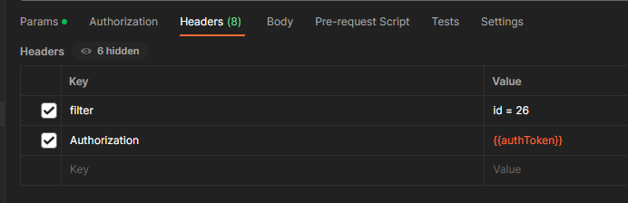
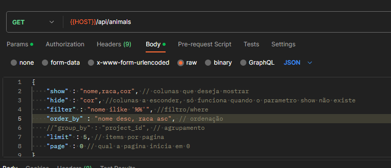
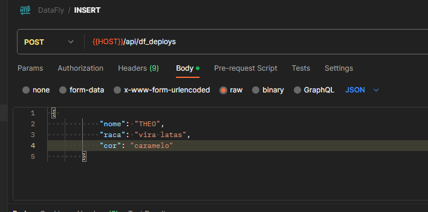
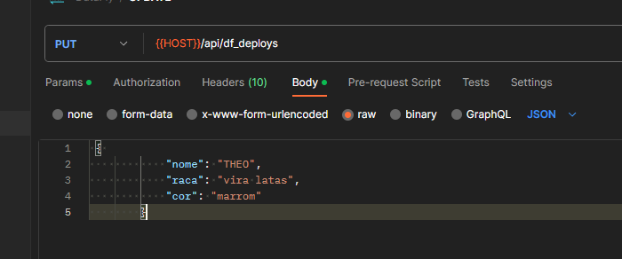
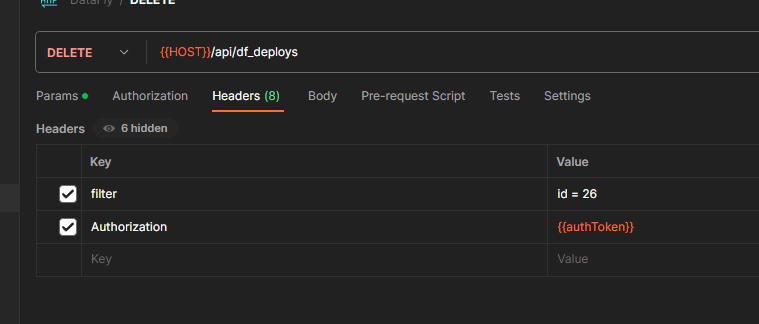

# Requisito
- Docker
- Docker Compose
- Curl

# Preparar o ambiente
- 1 -  Clone esse repositório no servidor

- 2 - De permissão para execução ao script `./lib/build.sh` com o comando `chmod +x`

- 3 - Edite o arquivo `./api/bin/env.dart` com seus dados do postgress as keys de criptografia e jwt.

- 4 - Execute o comando SQL que está dentro de  `./api/bin/env.dart` (variavel migration) para criar a tabela de autorização para funcionamento dos tokens, login, cadastro, etc.

- 5 - Execute o comando `./lib/build.sh` para subir a API conteirnizada no docker

# CRUD

#### TODAS AS CHAMADAS PRECISAM DO AUTHORIZATION TOKEN NO HEADER!

### SELECT 

### INSERT

### UPDATE

### DELETE

